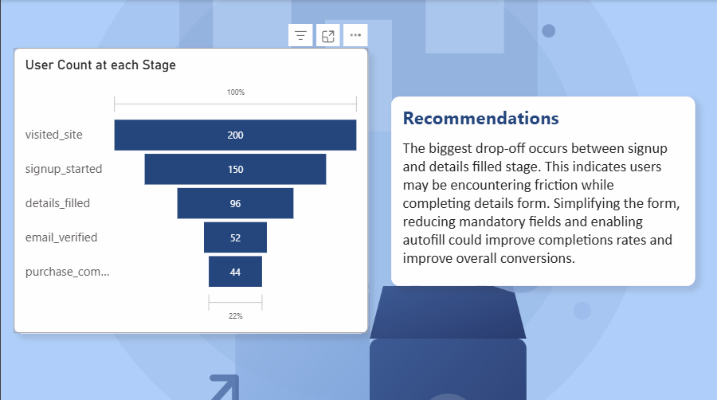
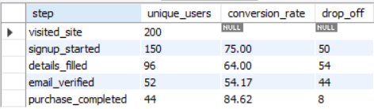

# 📊 User Funnel Drop-off Analysis

## Overview
This project analyzes user behavior across a signup funnel using SQL and Power BI. The objective was to calculate user conversion rates at each stage, identify the stage with the largest drop-off, and provide business recommendations to improve conversions.

---

## Dashboard

  

---

## Funnel Analysis Results

  

---

## Key Findings

- **Total Visitors:** 200
- **Successful Purchases:** 44
- **Overall Conversion Rate:** 22%
- **Largest Drop-off:** Signup Started → Details Filled (54 users)

---

## Recommendation

The biggest drop-off occurs between signup and details filled stage. This indicates users may be encountering friction while completing details form. Simplifying the form, reducing mandatory fields and enabling autofill could improve completions rates and improve overall conversions.

---

## Tools Used

- SQL (MySQL)
- Power BI

---

## Files

- `funnel_analysis.sql` – SQL analysis
- `User_Funnel_Analysis.pbix` – Power BI dashboard
- `dashboard.png` – Dashboard preview
- `funnel_analysis.png` – SQL output
